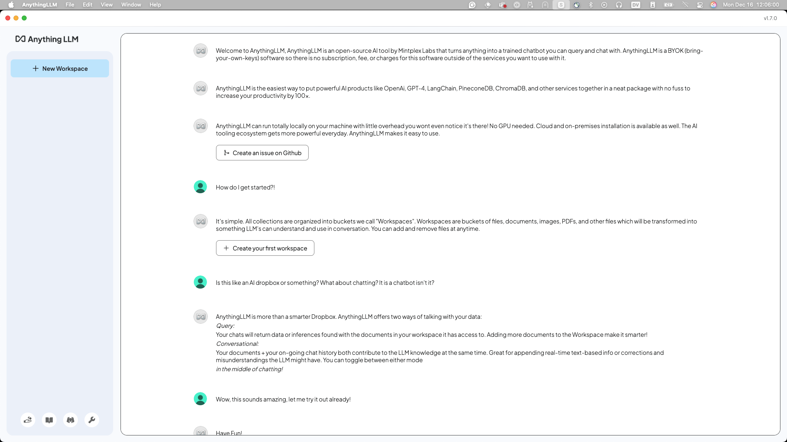
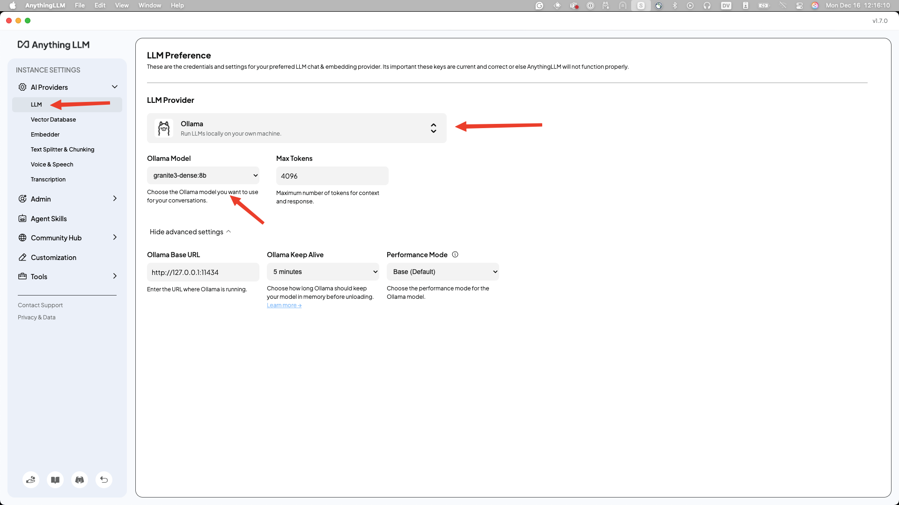
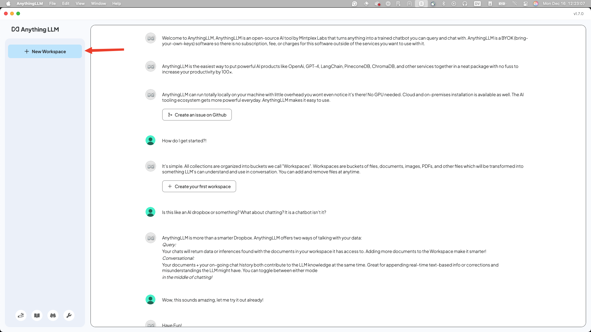
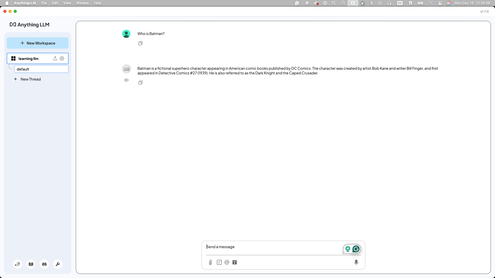
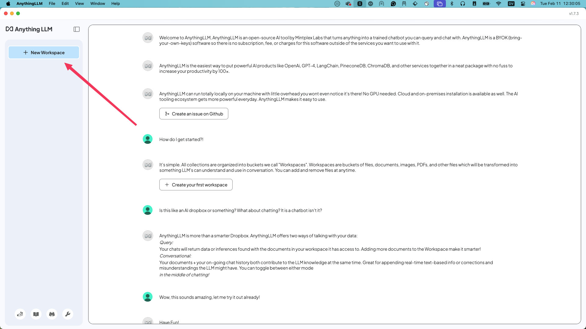
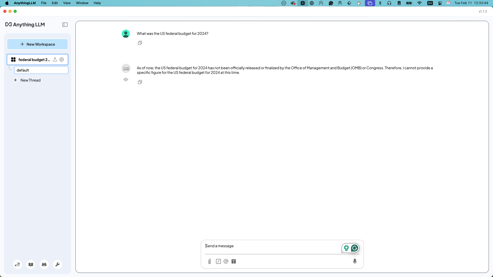
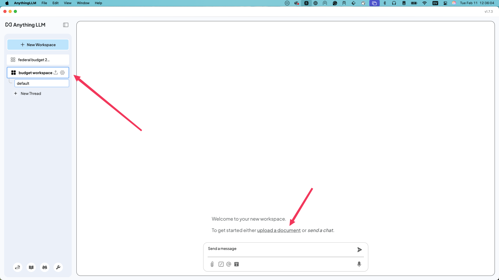
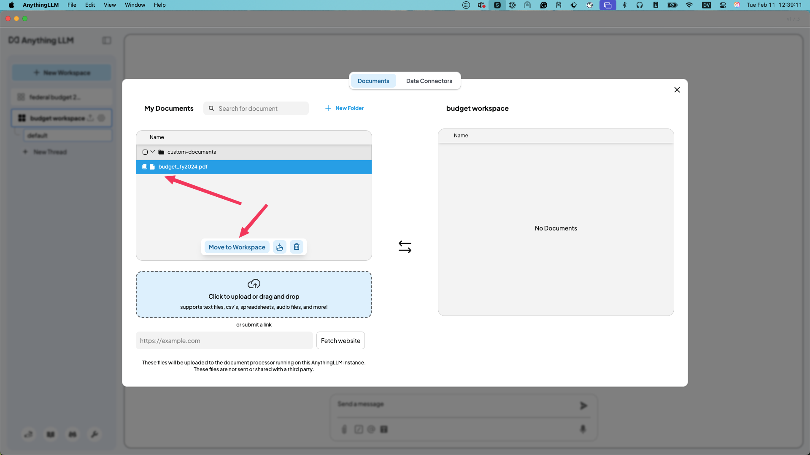
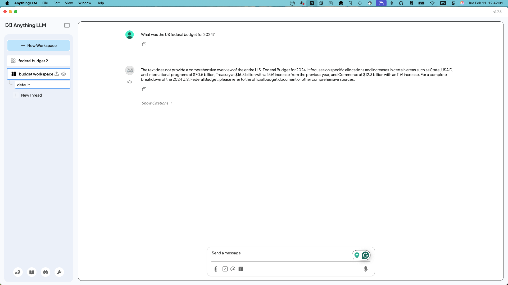

# How to use Granite/AnythingLLM/Ollama for a Basic Local RAG

This tutorial will help you set up AnythingLLM, Ollama, and Granite to work
together for local RAG.

## Set up Ollama

#### Mac installation steps

##### Download via the Ollama website

[Download Ollama](https://ollama.com/download/Ollama-darwin.zip) via the website.

Unzip the folder, and move the Ollama app to your applications folder.

##### Terminal Installation

Open up a terminal, and install [homebrew](https://brew.sh/).

```bash
/bin/bash -c "$(curl -fsSL https://raw.githubusercontent.com/Homebrew/install/HEAD/install.sh)"
```

After the installation is complete, install [ollama](https://ollama.com) via `brew`.

```bash
brew install ollama
```

### Windows installation steps

Install ollama via the website [here](https://ollama.com/download/windows).

## Download Grainite

After getting ollama setup open up a terminal or command prompt and run the following command. It
will pull `granite3.1-dense:8b` down to your local laptop!

```bash
ollama pull granite3.1-dense:8b
```

## Set up AnythingLLM

Head on over [here](https://anythingllm.com/desktop) choose the correct version
for your Operating System.

Now that you've gotten AnythingLLM installed we need to configure it to use models from `ollama` using the following screenshots as a guide.

Open up AnyThingLLM, and you should see something like the following:


```bash
ollama pull granite3.1-dense:8b
```

If you didn't know, the supported languages with `granite3.1-dense` now include:

- English, German, Spanish, French, Japanese, Portuguese, Arabic, Czech, Italian, Korean, Dutch, Chinese (Simplified)

And the Capabilities also include:

- Summarization
- Text classification
- Text extraction
- Question-answering
- Retrieval Augmented Generation (RAG)
- Code related tasks
- Function-calling tasks
- Multilingual dialog use cases
- Long-context tasks including long document/meeting summarization, long document QA, etc.

Next click on the `wrench` icon, and open up the settings. For now we are going to configure the global settings for `ollama`
but you may want to change it in the future.


Click on the "LLM" section, and select **Ollama** as the LLM Provider. Also select the `granite3-dense:8b` model. (You should be able to
see all the models you have access to through `ollama` there.)



Click the "Back to workspaces" button where the wrench was. And Click "New Workspace."



Name it something like "learning llm" or the name of the event we are right now, something so you know it's somewhere you are learning
how to use this LLM.


Now we can test our connections _through_ AnythingLLM! I like the "Who is Batman?" question, as a sanity check on connections and that
it knows _something_.



Now you may notice that the answer is slighty different then the screen shot above. That's expected and nothing to worry about.

Congratulations! You have AnythingLLM running now, configured to work with `granite3.1-dense` and `ollama`!

## Creating your own local RAG

Now that you have everything set up, lets build our own local RAG instance. You need a document, of some sort to questions to answer against
it. Lets start with something fun. As of right now, our Granite model doesn't know about the US Federal Budget in 2024, so lets
ask it a question about it to verify.

Create a new workspace, and call it whatever you want:



Now you have a new workspace, ask it a question like:

```
What was the US federal budget for 2024?
```

You should come back with something like the following, it may be different, but the gist is there.



Not great right? Well now we need to give it a way to look up this data, luckly, we have a backed up
copy of the budget pdf [here](https://github.com/user-attachments/files/18510560/budget_fy2024.pdf).
Go ahead and save it to your local machine, and be ready to grab it.

Now spin up a new workspace, (yes, please a new workspace, it seems that sometimes AnythingLLM has
issues with adding things, so a clean environment is always easier to teach in) and call it
something else.



Click on the "upload a document" to get the pdf added.

Next we need to add it to the workspace.



Next click the upload or drag and drop and put the pdf in there, and then the arrow to move it to the
workspace. Click Save and Embed.

You have now added the pdf to the workspace.

Now when the chat comes back up ask the same question, and you should see some new answers!



It won't be exactly what we are looking for, but it's enough to now see that the Granite model can
leverage the local document index for RAG and in turn can _look things up_ for you. You'll need some prompt engineering
to get exactly what you want but this is just the start of leveraging the AI!


